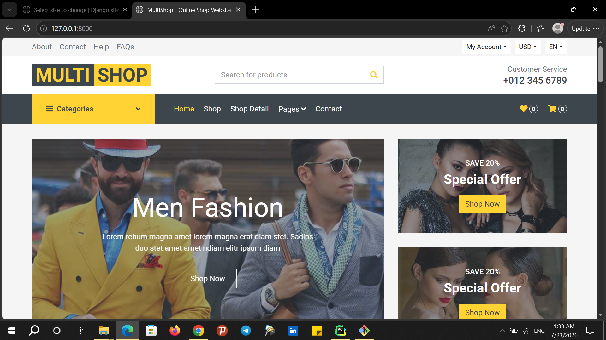
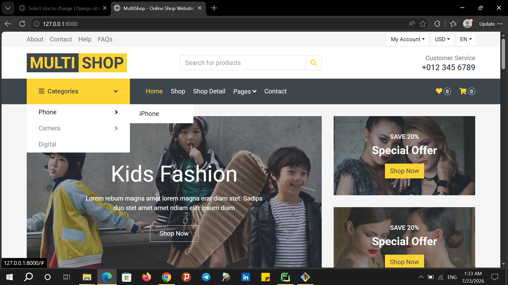
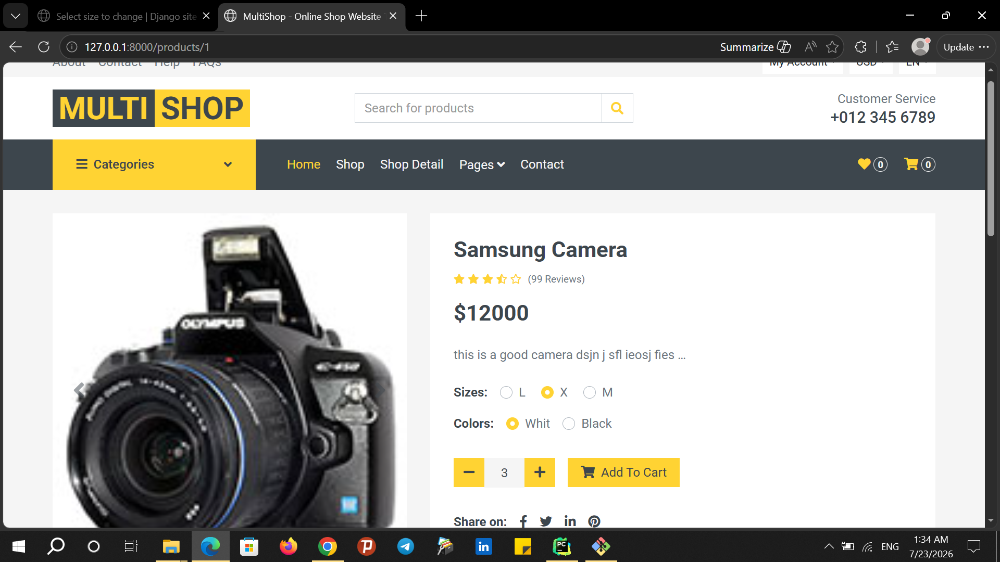
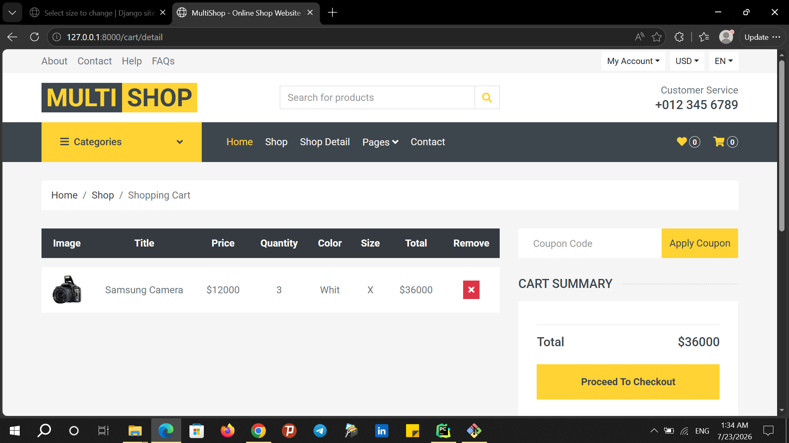
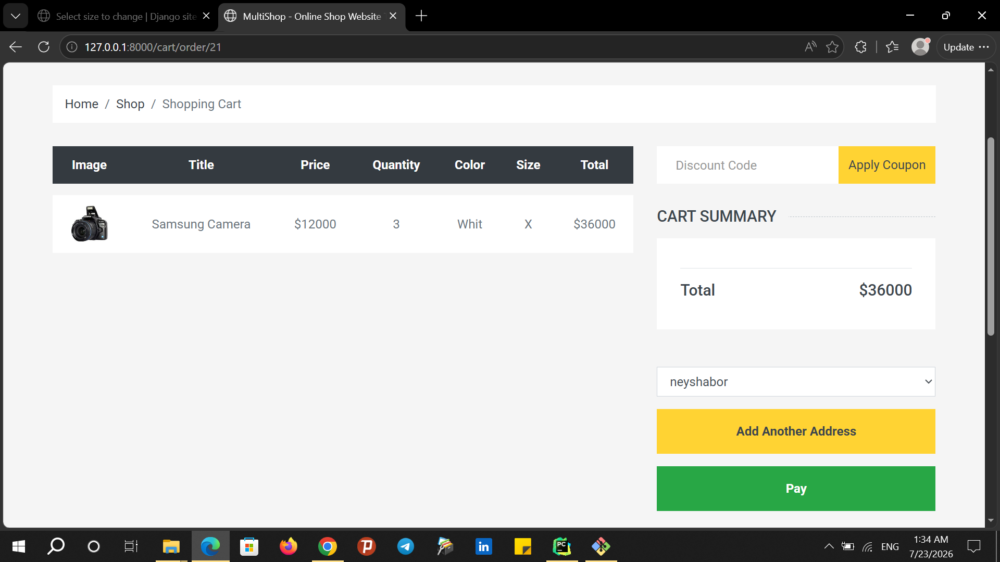

# 🛒 Django Multi Shop

یک پروژه فروشگاه اینترنتی توسعه داده شده با Python و Django.

An e-commerce web application built with Python and Django.

---

## 📖 درباره پروژه | About The Project

این پروژه یک فروشگاه اینترنتی است که با استفاده از فریم‌ورک Django توسعه داده شده است. کاربران می‌توانند محصولات را مشاهده کنند، محصولات را بر اساس قیمت، رنگ و سایز فیلتر کنند، محصولات مورد نظر خود را به سبد خرید اضافه کنند و سفارش ثبت کنند.

This project is an e-commerce web application developed using the Django framework. Users can browse products, filter products by price, color, and size, add products to their shopping cart, and place orders.

---

## ✨ امکانات پروژه | Features

- 🏠 صفحه اصلی فروشگاه | Home Page
- 🛍️ نمایش لیست محصولات | Product Listing
- 🔎 نمایش جزئیات محصولات | Product Details
- 🗂️ دسته‌بندی محصولات | Product Categories
- 🎨 فیلتر محصولات بر اساس رنگ | Filter Products by Color
- 📏 فیلتر محصولات بر اساس سایز | Filter Products by Size
- 💰 فیلتر محصولات بر اساس محدوده قیمت | Filter Products by Price Range
- 🛒 سبد خرید | Shopping Cart
- ➕ افزودن محصول به سبد خرید | Add Products to Cart
- ➖ تغییر تعداد محصولات | Update Product Quantity
- 🗑️ حذف محصولات از سبد خرید | Remove Products from Cart
- 📦 ثبت سفارش | Create Orders
- 👤 مدیریت کاربران | User Management
- 🔐 ورود و ثبت‌نام کاربران | User Authentication
- 🖼️ مدیریت تصاویر محصولات | Product Image Management
- 📱 طراحی واکنش‌گرا | Responsive Design

---

## 🛠️ تکنولوژی‌های استفاده شده | Technologies

- Python
- Django
- HTML5
- CSS3
- Bootstrap
- JavaScript
- jQuery
- SQLite

---

## 🚀 نصب و راه‌اندازی | Installation

### 1. دریافت پروژه | Clone Repository

    git clone YOUR_REPOSITORY_URL

### 2. ورود به پوشه پروژه | Open Project Directory

    cd Multi_shop_2

### 3. ساخت محیط مجازی | Create Virtual Environment

    python -m venv venv

### 4. فعال‌سازی محیط مجازی | Activate Virtual Environment

برای Windows:

    venv\Scripts\activate

### 5. نصب وابستگی‌ها | Install Dependencies

    pip install -r requirements.txt

### 6. اجرای Migrationها | Apply Migrations

    python manage.py migrate

### 7. ساخت کاربر مدیر | Create Superuser

    python manage.py createsuperuser

### 8. اجرای پروژه | Run Development Server

    python manage.py runserver

سپس آدرس زیر را در مرورگر باز کنید:

    http://127.0.0.1:8000/

---

## 🔍 فیلتر محصولات | Product Filtering

در این پروژه کاربران می‌توانند محصولات را بر اساس ویژگی‌های مختلف فیلتر کنند.

Users can filter products based on different attributes.

### فیلتر قیمت | Price Filter

- حداقل قیمت | Minimum Price
- حداکثر قیمت | Maximum Price

### فیلتر رنگ | Color Filter

کاربران می‌توانند یک یا چند رنگ را برای فیلتر کردن محصولات انتخاب کنند.

Users can select one or multiple colors to filter products.

### فیلتر سایز | Size Filter

کاربران می‌توانند محصولات را بر اساس سایز مورد نظر خود فیلتر کنند.

Users can filter products based on the desired size.

---

## 🛒 سبد خرید | Shopping Cart

سیستم سبد خرید این امکان را فراهم می‌کند که کاربران محصولات مورد نظر خود را به سبد خرید اضافه کنند.

The shopping cart allows users to add their desired products to the cart.

### امکانات سبد خرید | Shopping Cart Features

- افزودن محصول | Add Product
- انتخاب رنگ محصول | Select Product Color
- انتخاب سایز محصول | Select Product Size
- تغییر تعداد محصول | Update Quantity
- حذف محصول | Remove Product
- مشاهده قیمت محصول | View Product Price
- مشاهده مجموع قیمت | View Total Price

---

## 📦 سیستم سفارش | Order System

کاربران می‌توانند محصولات موجود در سبد خرید خود را به سفارش تبدیل کنند.

Users can create an order from the products added to their shopping cart.

### اطلاعات سفارش | Order Information

- کاربر | User
- محصول | Product
- تعداد | Quantity
- قیمت | Price
- تاریخ سفارش | Order Date

---

## 👨‍💻 پنل مدیریت | Admin Panel

مدیر سایت می‌تواند از طریق پنل مدیریت Django اطلاعات فروشگاه را مدیریت کند.

The administrator can manage the store through the Django Admin Panel.

### آدرس پنل مدیریت | Admin Panel URL

    http://127.0.0.1:8000/admin/

### بخش‌های قابل مدیریت | Manageable Sections
- کاربران | Users
- محصولات | Products
- دسته‌بندی‌ها | Categories
- سفارش‌ها | Orders
- اطلاعات محصولات | Product Information

---

## 🖼️ تصاویر پروژه | Screenshots

###Home Page | صفحه اصلی

###Home Page Category | دسته بندی محصولات

###Products | محصولات

###Shopping Cart | سبد خرید

###Paymant Section | بخش پرداخت

---

## 🔮 قابلیت‌های آینده | Future Improvements

برخی قابلیت‌هایی که می‌توانند در نسخه‌های آینده به پروژه اضافه شوند:

Possible features for future versions:

- 💳 درگاه پرداخت آنلاین | Online Payment Gateway
- ❤️ لیست علاقه‌مندی‌ها | Wishlist
- ⭐ امتیازدهی به محصولات | Product Ratings
- 💬 نظرات کاربران | User Reviews
- 🔎 جستجوی پیشرفته | Advanced Search
- 📧 ارسال ایمیل | Email Notifications
- 🚚 پیگیری سفارش | Order Tracking
- 🧾 صدور فاکتور | Invoice Generation
- 🌐 استقرار پروژه روی سرور | Production Deployment

---

## 📚 هدف پروژه | Project Purpose

این پروژه با هدف یادگیری و تقویت مهارت‌های برنامه‌نویسی Backend و توسعه وب با استفاده از Python و Django ساخته شده است.

This project was created to improve backend programming and web development skills using Python and Django.

---

## 👤 توسعه‌دهنده | Developer

H0ssein Shoshtary (Shisho)

Python & Django Developer

---

## 📄 لایسنس | License

این پروژه برای اهداف آموزشی و نمونه‌کار توسعه داده شده است.

This project was developed for educational and portfolio purposes.

---

⭐ اگر این پروژه برای شما مفید بود، می‌توانید Repository را Star کنید.

⭐ If you find this project useful, feel free to give the repository a Star.